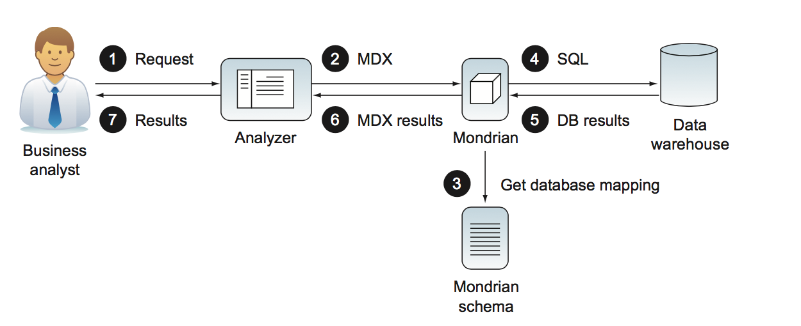

= Mondrian in Action
:hardbreaks:
:toc:
:sectnums:

== Beyond reporting: bussiness analitycs

=== The need for bussines analytics.
* OLAP: Online analytical processing is a technology that makes business
data available with enough structure for business users to easily explore data and discover important data relationships without having to understand database query languages or the organization of a company’s operational databases.
* Mondrian is an open source OLAP engine that provides access to data in a way
that’s intuitive to users. As an engine, Mondrian can be run in a web container, such as
Tomcat or JBoss, or be embedded as part of an application. Mondrian only requires
an optional configuration, a schema defining the logical structure of the data, and a
database populated with data. Mondrian works with most databases that support Java
database connections.

=== Replacing static reports with online analytical processing(OLAP).
=== OLAP to the rescue.

==== Mondrian let users drive analytics.

*   Mondrian supports user-driven analysis. Users are able to do their own analysis
without a lot of help from administrators or report writers.

==== Mondrian is low cost, low risk solution.
*   Mondrian is a low-cost, low-risk choice. Mondrian is open source and can be
downloaded for free. Mondrian also comes bundled with a number of analysis
tools and suites that make it easy to install and start using.

.  A business user decides to query some data using a number of different front
ends, typically a thin-client interface, such as Pentaho Analyzer.

. The interface creates a Multidimensional Expressions (MDX) query using
either a web service call or a direct API call. MDX is a standardized general
query language used for analysis and supported by most analytics engines. The
advantage of MDX is that it simplifies the calls to the database while also being
extremely powerful. It’s also a common dialect that can be used no matter what
database the data is stored in. Some user interfaces will allow users to directly
enter or modify queries in MDX, allowing users who are comfortable with MDX
syntax to perform more complex queries and use the many functions available
in MDX.

. Mondrian uses a logical schema, organized into cubes of dimensions (attributes
about the data, such as date and location) and measures (the actual data facts,
such as cost, inventory level, and the like). The schema also provides features
for performance optimization and security. Mondrian uses this schema to
retrieve the data either from an in-memory cache or by generating optimized
database calls. Mondrian automatically creates correct SQL for a wide number
of databases.

. Mondrian generates SQL queries based on the metadata description and makes
a database request.

. The database returns a result set of data to Mondrian.

. Mondrian returns the data to the user interface, using a standard API that is understood by the visualization tool.

. Finally, the data is formatted graphically for the user in a tabular format that’s easy to understand and manipulate.

==== Mondrian is fast.
*   Mondrian is fast. It has a variety of optimization techniques that allow users to
perform analysis at the speed of thought using interactive tools.

** Agregates.
** Caching.

==== Mondrian is secure.
*   Mondrian has built-in security capabilities, making it ideal for organizations
with sensitive data.

==== Mondrian is based on open standarts.

*   Mondrian is based on open standards. It runs on a large variety of application
servers and works with most major databases. This means Mondrian won’t lock
you into a proprietary solution.

* In particular, Mondrian supports the following standards:

**   olap4j: An open standard for OLAP via Java

**   XMLA: A standard for system-to-system interaction based on SOAP

**   XML: A standard markup language that lets you create Mondrian schemas with a simple text editor

=== Sumary.

== Mondrian a firt look.

=== Mondrian role in analytics.
=== Running and using Mondrian.
==== Getting and running the software.
==== Navigating and viewing reports.
==== Interactive analytics.
==== MDX analitics with saiku.
=== Multidimensional modeling.
==== Sample report.
==== Modeling bussines questions.
=== Getting and ordering the data.
==== The data warehouse: physical storing the data.
==== Examining the Adventure Works data.
==== Populating the data.
== Creating the Data Mart.
=== Structuring data for analytics.
==== Characteristics of analytics systems.
==== Data Architecture for analytics.
==== Star schemas.
==== Comparing star schemas with 3NF.
==== Star schemas benefits.
=== Additional star schema modeling techniques.
==== Slowly Changing Dimensions (SCD's).
==== Time Dimensions.
==== SnowFlake design.
==== Degenerate and combination/junk dimensions.
=== Sumary.
== Multidimensional modeling: making analytics data accesible.
=== A simple schema.
==== Schema element. 
==== Cube element.
==== Attribute element.
==== Dimension element.
==== Measure element.
==== PhysicalSchema element.
=== Anatomy of a schema.
==== XML schema files.
==== Structure of schema.
==== Schema versioning and upgrading.
=== Dimensions, hierachies and levels.
==== Hierarchies and levels.
==== Time dimension. 
==== Attribute hierarchies.
==== The measures dimension.
=== Summary.
== How schemas grow.
=== Schema evolution.
==== Multiple cubes in a schema.
==== Shared dimensions.
==== Conformed dimensions. 
==== Using a dimension twice in the same cube.
==== Measures across multiple fact tables.
==== Smart evolution: multiples cubes versus single cubes.
==== Other schema evolution patterns.
=== Alternativa ways to store dimensions.
==== Star dimensions.
==== Snowflake dimensions.
==== Degenerate dimensions.
=== Advanced hierarchy structures.
==== Parent-child hierarchies.
==== Ragged hierarchies.
=== Calculations.
==== Bucketing attributes.
==== Calculated members.
=== Summary.
== Security data.
=== Use of roles.
==== What's a role.
==== Declaring roles in the mondrian schema.
==== Enforcement of roles.
=== Security grants.
==== Schema grants.
==== Cube grants.
==== Dimension and hierarchy grants.
==== Member grants.
==== Measure grants.
=== Summary. 
== Maximizing Mondrian performance.
=== Figuring out where the problem are.
==== Performance improvement process.
==== Preparing for performance  analysis and establishing current performance.
=== Tunning the database.
=== Aggregate tables.
==== Creating aggregate tables.
==== Declaring an aggregate table.
==== Which aggregates should create.
=== Caching.
==== Types of caches.
==== External segment cache.
=== Priming the cache.
=== Flushing the cache.
==== Flushing the schema cache.
==== Flushing specific cubes.
==== Flushing specific regions of the cache.
==== Summary.
== Dinamyc security.
=== Preparing for dynamic security.
==== Creating an action sequence.
==== Configuring and running the action sequence.
=== Restricting data usion a dynamic schema processor.
==== Modifying the schema to support a DSP.
==== Example of DSP.
==== Configuring the DSP.
=== Restricting data using dynamic role modification.
==== Preparing the schema.
==== Custom MDX connection.
==== Custom delegate role and custom hierarchy access.
==== Configuring the custom MDX connection.
=== Deciding which security approach to use.
=== Summary.
== Working with Mondrian and Pentaho.
=== Pentaho Analyzer.
==== Overview of Pentaho Analyzer.
==== Using analyzer for analysis.
==== Charting with analyzer.
==== Special schema annotations for using Analyzer.
=== Saiku.
=== Community DashBoard Framework.
==== Creating a CDF dashboard.
==== Using community data access.
=== Pentaho report dessigner.
==== Creating an OLAP data source.
==== Using parameters.
==== PRD and the dynamic schema processor.
=== Pentaho Data Integration.
=== Summary.
== Developing with Mondrian.
=== Calling Mondrian from a thin client.
==== XML for a Analysis (XMLA).
==== Configuring Mondrian as an XMLA web service.
==== Calling XMLA services with Ajax.
==== XMLA for JavaScript (xmla4js).
=== Calling Mondrian from Java Application.
==== Creating connections via olap4j.
==== Queryng data.
=== Summary.
== Advanced analytics.
=== Advanced analytics in Mondrian with MDX.
==== Running MDX querys.
==== Ratios and growth.
==== Time-specific MDX.
==== Advanced MDX.
=== What-if analysis.
=== Stadistics and machine learning.
==== R.
==== Weka.
=== Big Data.
==== Analytics databases.
==== Hadoop and Hive.
==== NoSQL systems and Hadoop.
=== Summary.
== Appendix A: Installing and running Mondrian.
== Appendix B: Online resources.
== Appendix C: Schema shorcuts.
