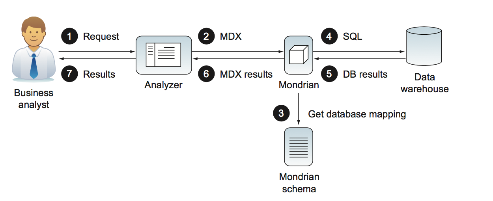
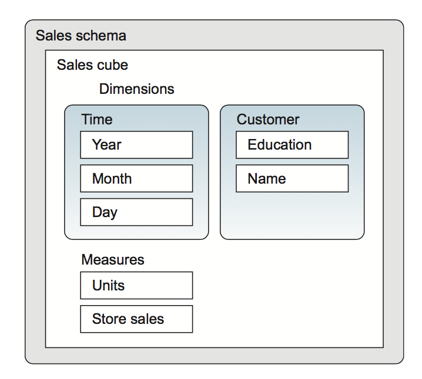
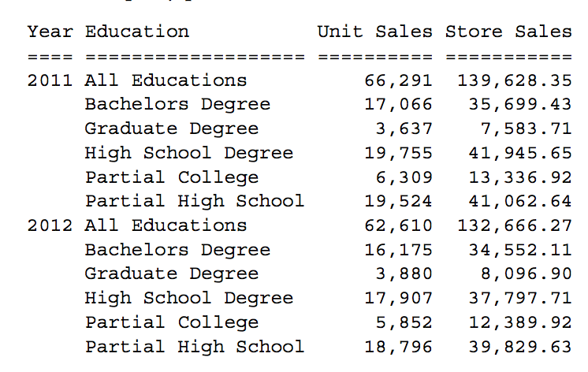
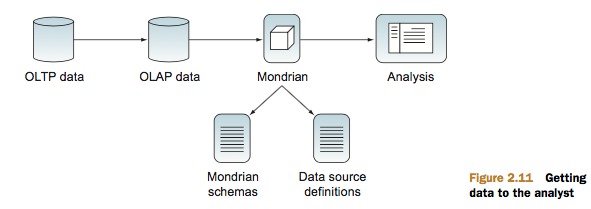
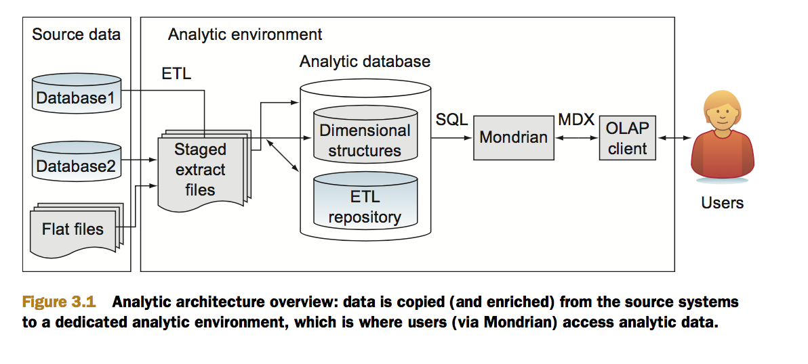
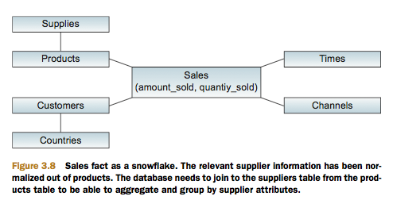

= Mondrian in Action
:hardbreaks:
:toc:
:sectnums:

== Beyond reporting: bussiness analitycs

=== The need for bussines analytics.
* OLAP: Online analytical processing is a technology that makes business
data available with enough structure for business users to easily explore data and discover important data relationships without having to understand database query languages or the organization of a company’s operational databases.
* Mondrian is an open source OLAP engine that provides access to data in a way
that’s intuitive to users. As an engine, Mondrian can be run in a web container, such as
Tomcat or JBoss, or be embedded as part of an application. Mondrian only requires
an optional configuration, a schema defining the logical structure of the data, and a
database populated with data. Mondrian works with most databases that support Java
database connections.

=== Replacing static reports with online analytical processing(OLAP).
=== OLAP to the rescue.

==== Mondrian let users drive analytics.

*   Mondrian supports user-driven analysis. Users are able to do their own analysis
without a lot of help from administrators or report writers.

==== Mondrian is low cost, low risk solution.
*   Mondrian is a low-cost, low-risk choice. Mondrian is open source and can be
downloaded for free. Mondrian also comes bundled with a number of analysis
tools and suites that make it easy to install and start using.

.  A business user decides to query some data using a number of different front
ends, typically a thin-client interface, such as Pentaho Analyzer.

. The interface creates a Multidimensional Expressions (MDX) query using
either a web service call or a direct API call. MDX is a standardized general
query language used for analysis and supported by most analytics engines. The
advantage of MDX is that it simplifies the calls to the database while also being
extremely powerful. It’s also a common dialect that can be used no matter what
database the data is stored in. Some user interfaces will allow users to directly
enter or modify queries in MDX, allowing users who are comfortable with MDX
syntax to perform more complex queries and use the many functions available
in MDX.

. Mondrian uses a logical schema, organized into cubes of dimensions (attributes
about the data, such as date and location) and measures (the actual data facts,
such as cost, inventory level, and the like). The schema also provides features
for performance optimization and security. Mondrian uses this schema to
retrieve the data either from an in-memory cache or by generating optimized
database calls. Mondrian automatically creates correct SQL for a wide number
of databases.

. Mondrian generates SQL queries based on the metadata description and makes
a database request.

. The database returns a result set of data to Mondrian.

. Mondrian returns the data to the user interface, using a standard API that is understood by the visualization tool.

. Finally, the data is formatted graphically for the user in a tabular format that’s easy to understand and manipulate.

==== Mondrian is fast.
*   Mondrian is fast. It has a variety of optimization techniques that allow users to
perform analysis at the speed of thought using interactive tools.

** Agregates.
** Caching.

==== Mondrian is secure.
*   Mondrian has built-in security capabilities, making it ideal for organizations
with sensitive data.

==== Mondrian is based on open standarts.

*   Mondrian is based on open standards. It runs on a large variety of application servers and works with most major databases. This means Mondrian won’t lock you into a proprietary solution.

* In particular, Mondrian supports the following standards:

**   olap4j: An open standard for OLAP via Java

**   XMLA: A standard for system-to-system interaction based on SOAP

**   XML: A standard markup language that lets you create Mondrian schemas with a simple text editor

=== Sumary.

== Mondrian a firt look.

=== Mondrian role in analytics.

.Some products that use Mondrian
[width="90%",frame="topbot",options="heade"]
|=======
|Name |Description
|Pentaho Analyzer |Pentaho’s enterprise analysis UI that provides interactive analysis with tables and graphs.
|Pentaho Reporting |A reporting tool that creates pixel-perfect reports using Mondrian data.
|Community Dashboard Framework|A popular open source dashboard framework for creating interactive dashboards.
|Saiku| A free open source analytics tool that provides interactive analysis with tables and graphs. Saiku is available as a Pentaho plugin or a standalone product.
|=======

=== Running and using Mondrian.

.Pentaho comes in two flavors: 
* Community Edition (CE) 
* Enterprise Edition(EE): requires the purchase of licenses but comes
with additional features and support.

==== Getting and running the software.
==== Navigating and viewing reports.
==== Interactive analytics.
==== MDX analitics with saiku.

* Saiku lets you go beyond drag and drop and perform advanced analysis using
MDX queries. 
* Multidimensional Expressions (MDX) is a query language for OLAP
that allows you to use advanced techniques, such ratio to reported, parallel period comparisons, period over period growth, traffic lighting, and so forth.

=== Multidimensional modeling.

Mondrian, as an OLAP engine,
presents data multidimensionally: the content are data facts that the business analysts want to know about, such as sales and inventory, and the dimensions are attributes about the data for analysis, such as warehouse, geography, customer demographics, and so on.

==== Sample report.

[source,]
----

SELECT {[Measures].[Units],
        [Measures].[Store Sales]} ON COLUMNS,
   Crossjoin([Time].[Year].Members,
             [Customer].[Education].Members) ON ROWS
----

==== Modeling bussines questions.

IMPORTANT: EVOLVING A SCHEMA Mondrian makes it easy to evolve a schema by adding attributes, dimensions, measures, and calculations when you need them. The dimensional model can be gleaned by listening to the business user’s question.

.Each of the key concepts will likely turn into a cube, an attribute, a dimension, or a measure. 
* Attributes correspond to nouns, and attributes that are related (because
they describe the same entity in the business) are grouped into dimensions. 
* Quantifiable values are measures. 
* Cubes describe business processes, so they tend to appear as verbs. If the business user says “compare based on ...” or “break down by ...”, the next noun will likely be something that will become an attribute in the dimensional model.

.In summary:

* Measures are the quantities you use to analyze a business process.
* Attributes are how you slice the set of measurements into regions that you can compare.
* Dimensions are convenient collections of attributes.
* Cubes contain the measures, attributes, and dimensions necessary to answer a particular business question.

=== Getting and ordering the data.

==== The data warehouse: physical storing the data.

* Mondrian is a *relational OLAP (ROLAP)* engine, meaning that the data is stored in a relational database and Mondrian translates MDX queries into SQL queries for the particular RDBMS you use for storage. 

* star schemas: The star schema is simplified by combining related data into single, denormalized tables.footnoteref:[For example, the City-State, State-Country, Country-Territory tables are all combined into a Geography table. This means that there are multiple copies of a state to country mapping, increasing data storage and possibly requiring the update of multiple records should a mapping change (for example, if a country splits into multiple countries). In chapter 3, we’ll talk about ways to avoid the redundancy, but the choice
is generally to pay for additional storage to get faster analysis. The time of a business analyst is usually worth much more than the cost of additional storage space.]

==== Examining the Adventure Works data.
==== Populating the data.

* The data in the warehouse is populated via a process known as extract, transform, and load (ETL).
* An additional benefit of moving data from transactional systems to analytics systems is that the multiple data sources can be combined into a single data warehouse.
* Pentaho also provides an open source tool called *Kettle* (a.k.a. Pentaho Data Integration, or *PDI*) that makes ETL much easier. 
* Kettle provides a graphical interface, called *Spoon*, that allows users to graphically create sequences of steps to manipulate data. 

== Creating the Data Mart.
Mondrian has adopted the use of star schema structures based on industry best practices.

=== Structuring data for analytics.
==== Characteristics of analytics systems.
*   Fast.
*   Consistent and accurate.
* Information focused.

==== Data Architecture for analytics.

* Copy data to systems dedicated for analytics.
* Transform, clean, and enrich data for analytics.
--
Analytics should be done on separate computer resources and include data that has been cleaned, transformed, and enriched from multiple source systems.
--

==== Star schemas.

* For all intents and purposes, Mondrian expects your data to be in a relational database, in the star schema format (or one of its closely related permutations). The starschema, as a set of relational database tables, is what Mondrian uses as the basis to perform aggregations and analytics.
* A star schema consists of a fact table surrounded by multiple dimension tables. The shape of a fact surrounded by dimensions is how the star schema gets its name.
** _**Fact tables**_ contain the stuff you’re trying to aggregate, total, and measure. 
** The numbers that are added together to create the total sales number are contained in the fact table and are referred to as the *__measures__* in the cubes.

** *__Dimension__* tables contain the qualifying attributes that you want to split out those numbers (the measures) by. 

.Physical database model:
*   *__Dimension__* 
** tables that contain rows, independent of the transactions that have the attributes. 
** For instance, a product dimension would contain a row per product and contain information on product categories, vendors, departments, and the like. 
** Typically this foreign key is also non-nullable, so that you can aggregate the table at any combination of dimensions and always get the same sum total.
**  Dimension tables are highly denormalized.

*   A single _**fact table**_ that contains a row for the individual transactions (order line items, individual clicks) matching the grain of the table (see Kimball’s book for more information on “grain”). The fact table contains a set of surrogate integer keys that easily join to the dimension tables for the attributes associated. Additionally, it will usually have one or more columns that contain the values to be aggregated, associated with that single transaction.

==== Comparing star schemas with 3NF.
.The 3NF modeling techniques are ideal in the following situations:
* Lots of concurrent users reading and modifying data—Keeping similar data together.
* Subprograms and people are accessing small slices of data.
* Source systems usually access smaller slices of data joined together with a foreign key.

==== Star schemas benefits.
* Star schemas require at most one pass through the table. 
* Missing join keys don’t cause sum-total issues in star schemas. 
* Many databases have physical optimizations for star schemas. 
* Star schemas are the preferred structure for Mondrian, but they’re also easier for anyone writing SQL.

=== Additional star schema modeling techniques.
* Techniques for handling changes to dimension data over time.
* Performance enhancements.

==== Slowly Changing Dimensions (SCD's).

Imagine one customer (Bob) who changes his residence, their purchases can appear in the actual residence, the old one or each in the place where the customer lived when the purchase occurred.

* SCD Type 1:  
** Is a dimensional modeling technique that, as in our example source system, keeps a single version of the entity.No history of changes is kept.
** Type I dimensions are often used for items that don’t change frequently.
* SCD Type 2:
** SCD Type II dimensions keep a history of changes to the attributes of the dimension. For Type II dimensions, the surrogate key is meaningless and it’s used only as a simple, single-key join from the fact table.
** There is a new unique key that’s normally omitted from the physical database schema but is a logical constraint: a combination of the natural key and the effective date identifies unique records in a dimension.
** When loading the fact table, the ETL system examines the date of the sale
(sales_date) and chooses which version of the dimension key to use. 
** SCD Type II dimensions are used when a history of changes and attributes is needed. This is very common, and Type II dimensions are used much of the time.

** SCD Type III dimensions are often used when you bring in a second classification system, and you don’t think of it as a “change” so
much as an additional method of bucketing or classifying.

==== Time Dimensions.

* Time dimensions are denormalized Type I dimensions where the natural (and usually the primary) key is the date. Type I is almost always appropriate because the attributes rarely change. 

* All of the relevant pieces of the date, such as the month name, quarter, and day of the week, are denormalized and included as columns in the table.

* The key of 1 of January 2017 would be 20170101.

==== SnowFlake design.
You can use one level of normalization on dimensions (anadditional join) for various operational and performance reasons.

.Use of snowflake:

*   To reduce the size of dimension tables by factoring out seldom used but really big columns.

*   To more easily manage a Type I type attribute in an otherwise Type II dimension.Consider the snowflake design in figure 3.8, where we’ve factored out countries from customer. It’s likely that many customer attributes will change over time (including which country the customer lives in) and will need to be managed as Type II dimensions. The attributes of the country, however, such as its name, tend to be Type I changes when they happen (updates, without any history). 

==== Degenerate and combination/junk dimensions.
.Degenerate Dimension
* There are times when creating a whole separate dimension table, including a foreign key reference, and then grouping by attribute just doesn’t make sense for performance reasons. 
* For the single attribute dimensions (channel and sales type) it seems overkill to maintain entire dimensions with only single-attribute, low-ordinality dimensions. We can include these attributes as columns
directly in the fact table, eliminating the separate table and additional join entirely.
* Mondrian can be configured so that columns in the fact table still show as a separate dimension, but will use the columns directly from the fact table without doing any additional joins.
* This only works for small, low-ordinality columns or very large high-growth attributes that grow with the fact table.
.Combination/junk dimensions.
* There’s another technique for taking lots of single-attribute degenerate dimensions, and putting them back into a standard dimension of unrelated attributes.
* Junk dimensions are created in a unique way: a Cartesian product of all possible combinations of attributes is created, along with a surrogate key. Then, when you’re loading the fact table, the loading process looks into the junk dimensions to grab the record with the correct set of attributes.

=== Sumary.
== Multidimensional modeling: making analytics data accesible.
=== A simple schema.
==== Schema element. 
==== Cube element.
==== Attribute element.
==== Dimension element.
==== Measure element.
==== PhysicalSchema element.
=== Anatomy of a schema.
==== XML schema files.
==== Structure of schema.
==== Schema versioning and upgrading.
=== Dimensions, hierachies and levels.
==== Hierarchies and levels.
==== Time dimension. 
==== Attribute hierarchies.
==== The measures dimension.
=== Summary.
== How schemas grow.
=== Schema evolution.
==== Multiple cubes in a schema.
==== Shared dimensions.
==== Conformed dimensions. 
==== Using a dimension twice in the same cube.
==== Measures across multiple fact tables.
==== Smart evolution: multiples cubes versus single cubes.
==== Other schema evolution patterns.
=== Alternativa ways to store dimensions.
==== Star dimensions.
==== Snowflake dimensions.
==== Degenerate dimensions.
=== Advanced hierarchy structures.
==== Parent-child hierarchies.
==== Ragged hierarchies.
=== Calculations.
==== Bucketing attributes.
==== Calculated members.
=== Summary.
== Security data.
=== Use of roles.
==== What's a role.
==== Declaring roles in the mondrian schema.
==== Enforcement of roles.
=== Security grants.
==== Schema grants.
==== Cube grants.
==== Dimension and hierarchy grants.
==== Member grants.
==== Measure grants.
=== Summary. 
== Maximizing Mondrian performance.
=== Figuring out where the problem are.
==== Performance improvement process.
==== Preparing for performance  analysis and establishing current performance.
=== Tunning the database.
=== Aggregate tables.
==== Creating aggregate tables.
==== Declaring an aggregate table.
==== Which aggregates should create.
=== Caching.
==== Types of caches.
==== External segment cache.
=== Priming the cache.
=== Flushing the cache.
==== Flushing the schema cache.
==== Flushing specific cubes.
==== Flushing specific regions of the cache.
==== Summary.
== Dinamyc security.
=== Preparing for dynamic security.
==== Creating an action sequence.
==== Configuring and running the action sequence.
=== Restricting data usion a dynamic schema processor.
==== Modifying the schema to support a DSP.
==== Example of DSP.
==== Configuring the DSP.
=== Restricting data using dynamic role modification.
==== Preparing the schema.
==== Custom MDX connection.
==== Custom delegate role and custom hierarchy access.
==== Configuring the custom MDX connection.
=== Deciding which security approach to use.
=== Summary.
== Working with Mondrian and Pentaho.
=== Pentaho Analyzer.
==== Overview of Pentaho Analyzer.
==== Using analyzer for analysis.
==== Charting with analyzer.
==== Special schema annotations for using Analyzer.
=== Saiku.
=== Community DashBoard Framework.
==== Creating a CDF dashboard.
==== Using community data access.
=== Pentaho report dessigner.
==== Creating an OLAP data source.
==== Using parameters.
==== PRD and the dynamic schema processor.
=== Pentaho Data Integration.
=== Summary.
== Developing with Mondrian.
=== Calling Mondrian from a thin client.
==== XML for a Analysis (XMLA).
==== Configuring Mondrian as an XMLA web service.
==== Calling XMLA services with Ajax.
==== XMLA for JavaScript (xmla4js).
=== Calling Mondrian from Java Application.
==== Creating connections via olap4j.
==== Queryng data.
=== Summary.
== Advanced analytics.
=== Advanced analytics in Mondrian with MDX.
==== Running MDX querys.
==== Ratios and growth.
==== Time-specific MDX.
==== Advanced MDX.
=== What-if analysis.
=== Stadistics and machine learning.
==== R.
==== Weka.
=== Big Data.
==== Analytics databases.
==== Hadoop and Hive.
==== NoSQL systems and Hadoop.
=== Summary.
== Appendix A: Installing and running Mondrian.
== Appendix B: Online resources.
== Appendix C: Schema shorcuts.
